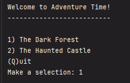

# Adventure Time
#### A choose your own adventure game.

## How to play

The player begins by choosing which game they want to play.




## The Design Process

This is a description of how I desinged and planned the game.

## Interesting Code

All of the game steps were in a csv file - I parsed each line of the file to create 
`Step` object.

```java
    String[] columns = line.split("\\|");

    int id = Integer.parseInt(columns[0]);
    String text = columns[1];
    String option1Text = columns[2];
    int option1NextId = Integer.parseInt(columns[3]);
    String option2Text = columns[4];
    int option2NextId = Integer.parseInt(columns[5]);
```

## Biggest Challenge

Describe your biggest challenge here